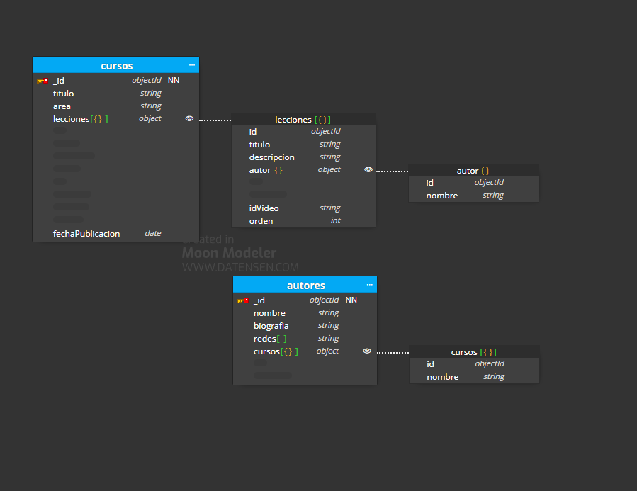

# Bootcamp Lemoncode Backend Continuo - [Documental] Modulo - 1- Modelado
## Caso  básico

Generar un modelado que refleje los siguiente requerimientos:

- Queremos mostrar los últimos cursos publicados.
- Queremos mostrar cursos por área (devops / front End ...).
- Queremos mostrar un curso con sus videos.
- En un video queremos mostrar su autor.

El planteamiento del modelado quedaría de la siguiente manera:

- Con un listado de cursos podemos ver rápidamente los últimos cursos publicados ordenando por fecha de publicación
- También podemos hacer un listado de los cursos filtrando por area
- Dentro del curso, he metido el objeto lecciones para que de un vistazo podamos ver todas sus lecciones/videos
- Dentro de la coleccion lecciones también he metido el objeto autor para que de un vistazo tengamos el nombre del autor de dicha lección.