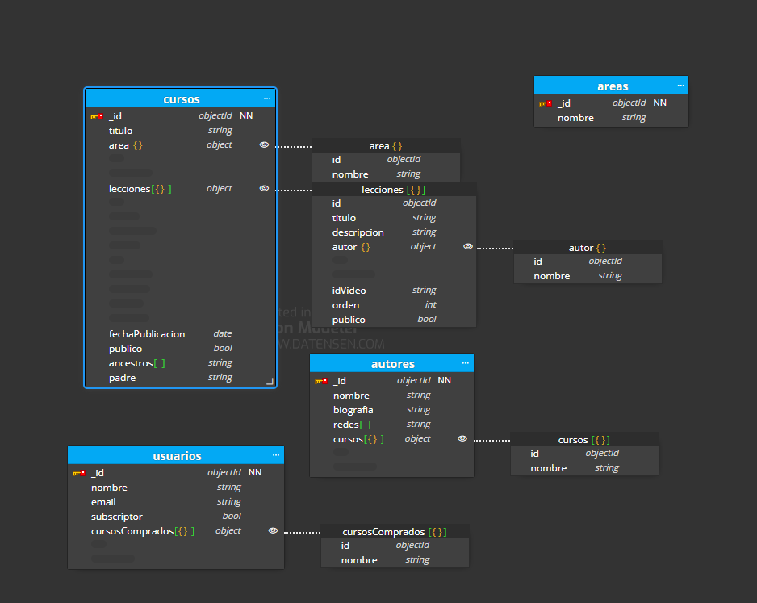

# Bootcamp Lemoncode Backend Continuo - [Documental] Modulo - 1- Modelado
## Caso  opcional

Generar un modelado que refleje los siguiente requerimientos, además de la parte básica:

- Queremos mostrar los últimos cursos publicados.
- Queremos mostrar cursos por área (devops / front End ...).
- Queremos mostrar un curso con sus videos.
- En un video queremos mostrar su autor.

***
**Tendremos que tener en cuenta lo siguiente:**  

Tener un sólo nivel de áreas es limitado, lo suyo sería tener una estructura jerárquica, por ejemplo:
* Front End >> React
* Front End >> React >> Testing
* Front End >> Angular
* Devops >> Docker
* Devops >> Serverless
* Backend >> nodejs
* Backend >> nodejs >> Express
* Backend >> mongo

Van a haber videos públicos y privados, es decir:
* Un curso puede ser 100% público.
* Un curso puede tener una parte inicial 100% pública, y otra sólo para subscriptores.
* Esto implica que hayan usuarios registrados y subscripciones.

El planteamiento del modelado quedaría de la siguiente manera:

- He añadido en cursos un campo publico. Así podremos ver si el curso es publico o privado.
- También en lecciones he añadido un campo publico, así un curso puede tener ciertas lecciones privadas.
- También he creado la colección usuarios, donde uno de sus campos es "subscriptor" con lo que sabremos si tiene acceso a los cursos privados.
- En la misma colección de usuarios, he añadido un array con los cursos comprados por el usuario. Así , si un día se da de baja, no se perderá los cursos que hubiese comprado.
- En cursos he añadido tambien dos campos. Ancestros y padre para poder usar el patrón Materialized Paths. Combinando Ancestor Array y el Parent Reference.
- Y he añadido la colección areas para en caso de cambiar en un futuro las areas, sea más facil de gestionar.